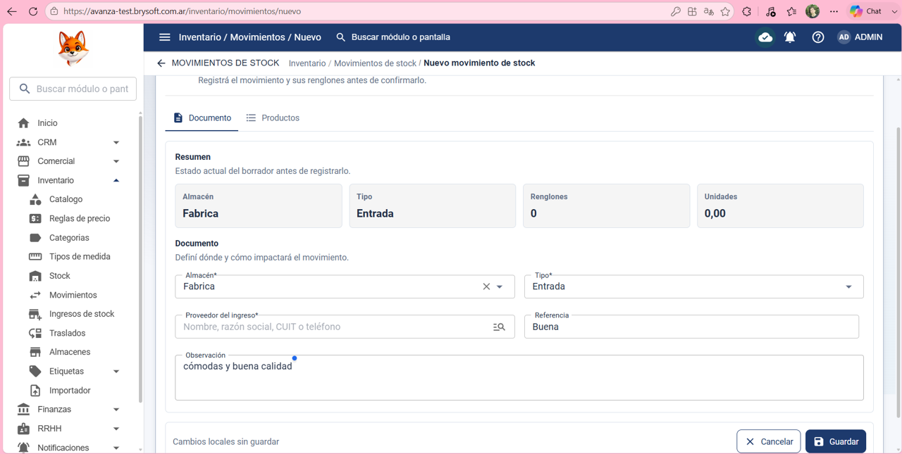
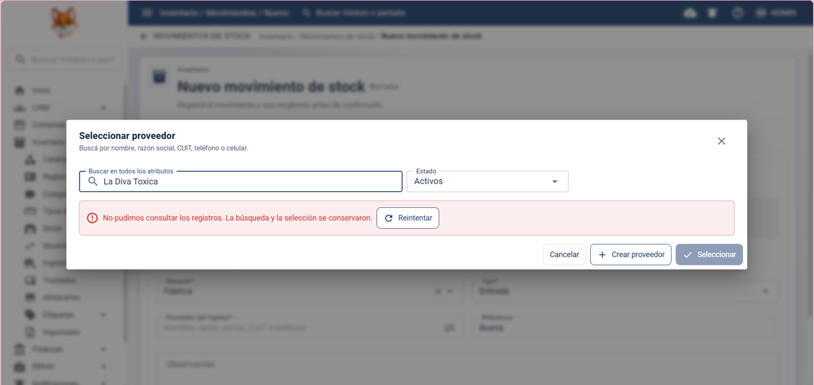
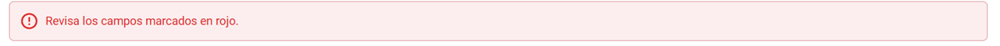
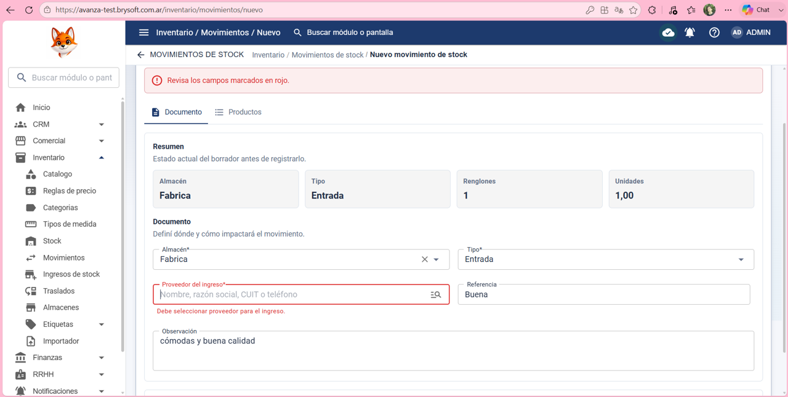

Precondición:
Que el usuario haya iniciado sesión correctamente y tenga acceso a inventario > Movimiento.

Pasos:

Pasos:

1- Hacer clic en Inventario

2- Hacer clic en Movimiento

3- hacer clic en nuevo movimiento

4- Poner en: Almacén: Fabrica 

5- Poner en: Tipo: Entrada

6- Poner en: Proveedor del ingreso: La Diva Toxica

7- El sistema no permite consultar/seleccionar proveedores.

8- Poner en: Referencia: Buena

9- Poner en: Observación: Cómodas y buena calidad 

10- Hacer clic en el tab productos 

11- Poner en: Producto: 6972858362262

12- Poner en: Cantidad: 15

13- Hacer clic en guardar 

Resultado esperado:
Que el sistema permita agregar un nuevo movimiento de stock correctamente y impacte en el producto en la lista de movimiento.

Resultado obtenido:
El sistema no permite consultar ni seleccionar proveedores. Al ser un campo obligatorio, el movimiento no puede guardarse aunque los demás datos y productos estén completos.

Impacto:
El usuario no puede agregar stock a un  producto.

Severidad: 🔴 Bloqueante 

## Evidencias

### Evidencia 1
[1q.png](../evidencias/BUG-002-no-permite-seleccionar-proveedor-al-crear-un-movimiento-de-stock/1q.png)

### Evidencia 2
[2q.png](../evidencias/BUG-002-no-permite-seleccionar-proveedor-al-crear-un-movimiento-de-stock/2q.png)

### Evidencia 3
[3q.png](../evidencias/BUG-002-no-permite-seleccionar-proveedor-al-crear-un-movimiento-de-stock/3q.png)

### Evidencia 4
[4q.png](../evidencias/BUG-002-no-permite-seleccionar-proveedor-al-crear-un-movimiento-de-stock/4q.png)

### Evidencia 5
[5q.png](../evidencias/BUG-002-no-permite-seleccionar-proveedor-al-crear-un-movimiento-de-stock/5q.png)

