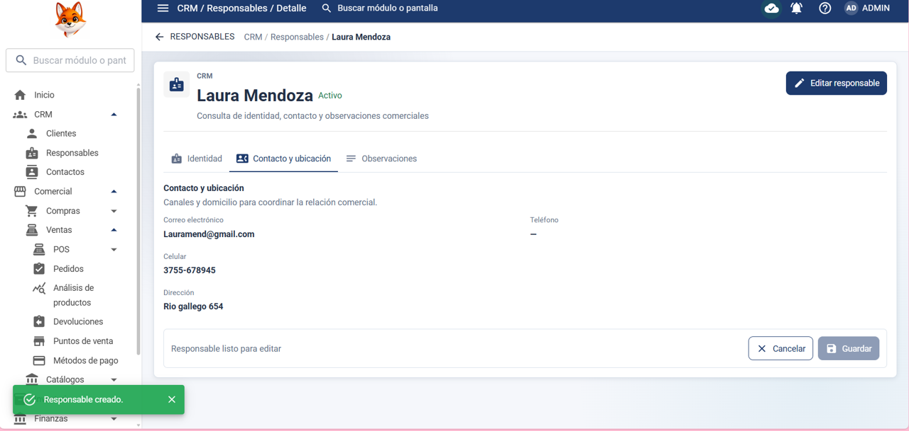
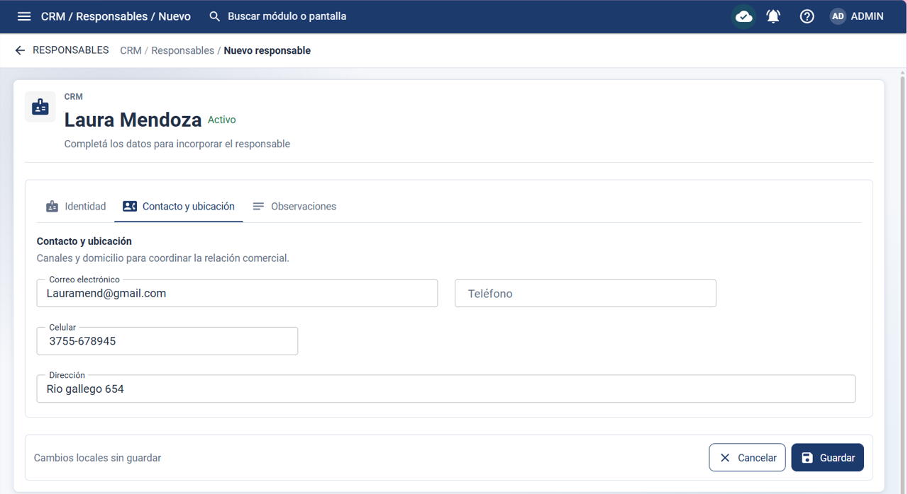
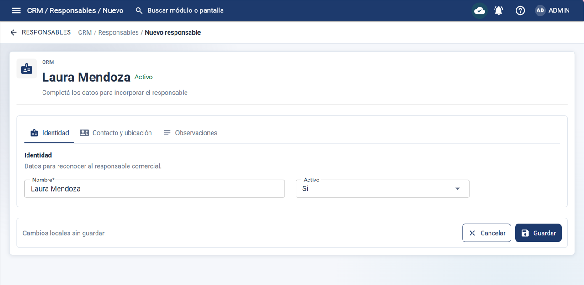

Precondición: 

El usuario debe haber iniciado sesión y tener el permiso Editar en CRM > Responsables.

Datos de prueba: 

 Completar los campos de IDENTIDAD:

Nombre: Laura Mendoza

Activo: Si

Completar los campos de CONTACTO Y UBICACIÓN:

Correo electrónico: Lauramend@gmail.com

Celular: 3755-678945

Dirección: Rio gallego 654

Pasos:  

1- Hacer clic en CRM > Responsables

2- Hacer clic en nuevo responsable

3- En IDENTIDAD poner:

4- Nombre: Laura Mendoza

5: Activo: SI

6- En CONTACTO Y UBICACIÓN poner:

7- Correo electrónico: Lauramend@gmail.com 

8- Celular: 3755678945

9- Dirección: Rio gallego 654

10- Hacer clic en GUARDAR 

Resultado esperado:

El resultado esperado es que el sistema cree correctamente un Responsable y lo muestra en la lista de responsables.

Resultado obtenido:

El responsable Laura Mendoza fue creado correctamente y aparece en la lista de responsables

Estado de la prueba: ✅ PASS

