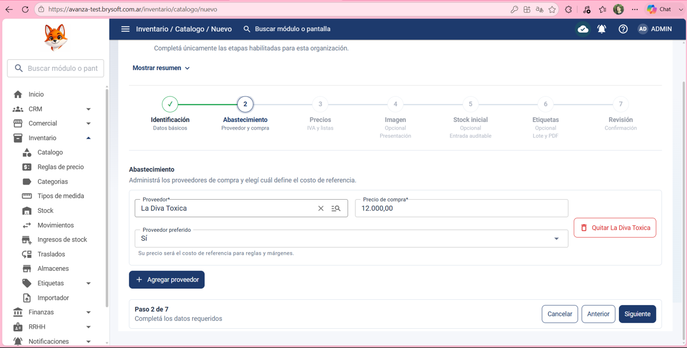
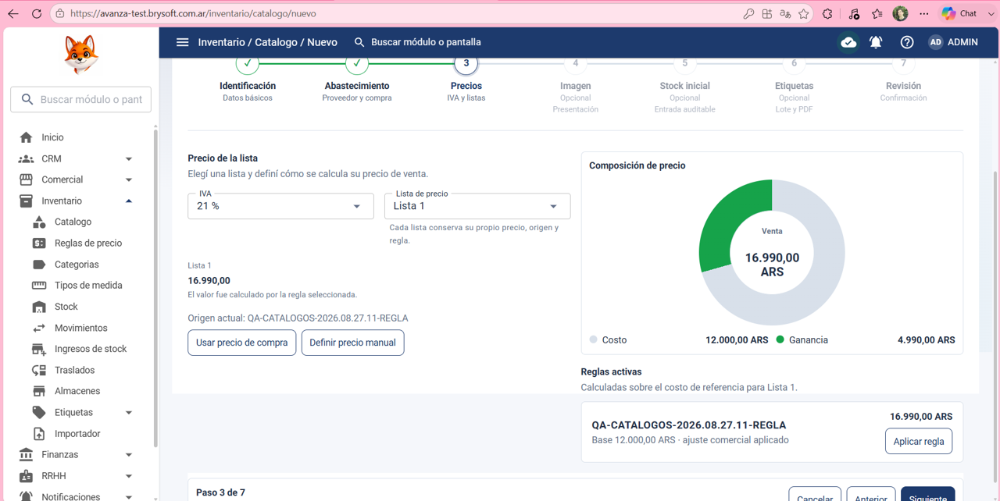
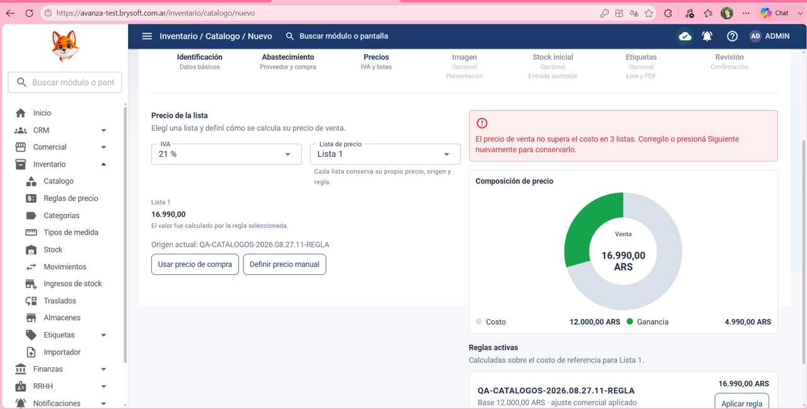
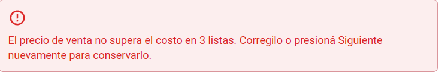
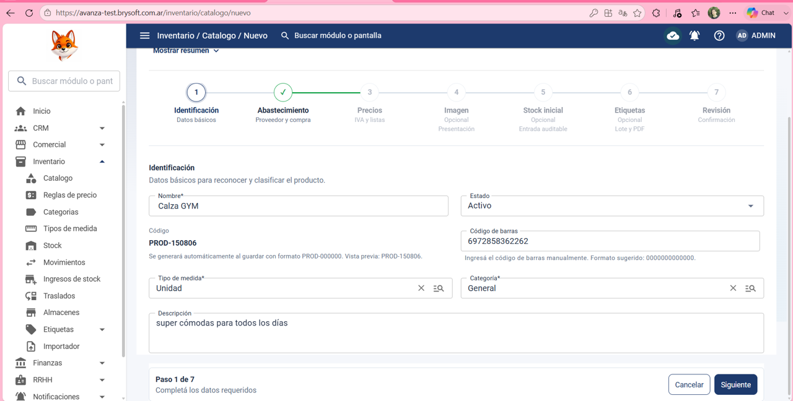

Precondición:
Que el usuario haya iniciado sesión correctamente y tenga acceso a inventario > catálogo.

Datos de prueba:

Nombre: Calza GYM

Estado: Activo

Código de barra: 6972858362262

Tipo de medida: Unidad

Categoría: General

Descripción: super cómodas para todos los días 

Precio de compra de referencia: 12000,00

Proveedor: La Diva Toxica

Proveedor preferido: Sí

IVA: 21%

Lista de precio: Lista 1

Pasos:

1- Hacer clic en inventario

2- Hacer clic en catalogo 

3- Hacer clic en: Nuevo producto

4- Poner en: Nombre: Calza GYM

5- Poner en: Estado: Activo

6- Poner en: Código de barra: 6972858362262

7- Poner en: Tipo de medida: Unidad

8- Poner en: Categoría: General

9- Poner en: Descripción: super cómodas para todos los días 

10- Hacer clic en siguiente 

11- Poner en: Precio de compra de referencia: 12000,00

12- Poner en: Proveedor: La Diva Toxica}

13- Poner en: Proveedor preferido: Sí

14- Hacer clic en siguiente 

15- Poner en: IVA: 21%

16- Poner en: Lista de precio: Lista 1

16- Presionar aplicar regla

17- Hacer clic en siguiente 

18-Pasos restantes:
⚠️ No ejecutados debido al bloqueo detectado en el paso 17.

Resultado esperado:
El sistema debe permitir avanzar por todas las etapas del alta y crear correctamente el producto, mostrándolo luego en el catálogo.

Resultado obtenido:
El sistema permanece en el paso 3 Precios y no permite avanzar al paso 4 Imagen, por lo que no fue posible completar el alta del producto.

Estado de la prueba:
 ❌ FAIL
### Evidencia - Ejecución 1 ❌ FAIL

