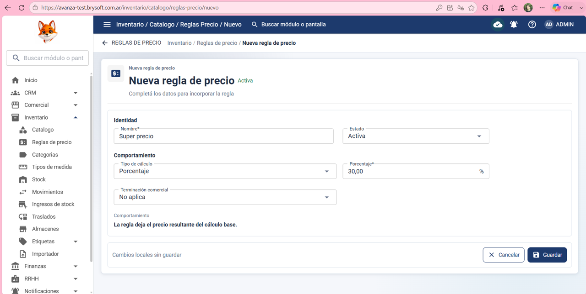
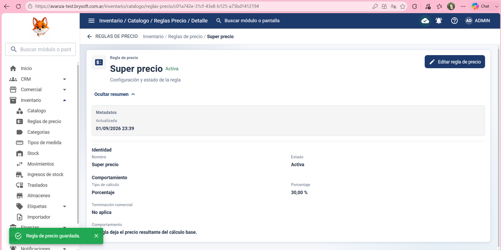
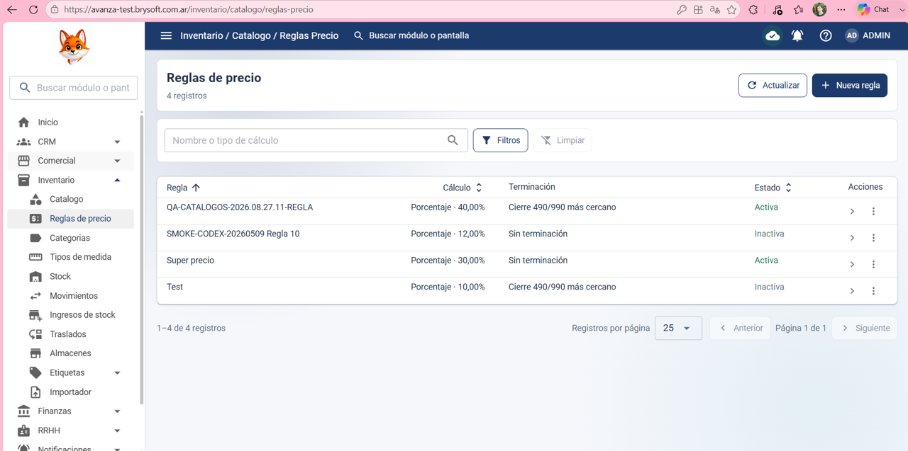

Precondición:
El usuario inició sesión y tiene permisos para crear/editar reglas de precio en Inventario > Reglas de precio.

Datos de prueba:

Nombre: Super precio 

Estado: Activo

Tipo de calculo: Porcentaje 

Porcentaje: 30,00 %

Terminación comercial: No aplica 

Pasos:
1- Hacer clic en Inventario

2- Hacer clic en Reglas de precio

3- Hacer clic en nueva regla

4- Poner en: Nombre: Super precio 

5- En Estado poner: Activo

6- En Tipo de Calculo poner: Porcentaje 

7- En Porcentaje poner: 30,00 %

8- Terminación comercial poner: No aplica 

9- presionar guardar 

Resultado esperado:
Que el Sitema guarde correctamente y se muestre en la lista de reglas de precio 

Resultado obtenido:
El sistema guardo correctamente y se mostró en la lista de reglas de precio 

Estado de la prueba:
✅ PASS

## Evidencia ✅ PASS

### 1. Datos de la regla

### 2. Regla guardada correctamente

### 3. Verificación final

