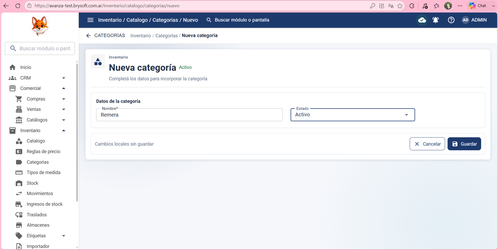
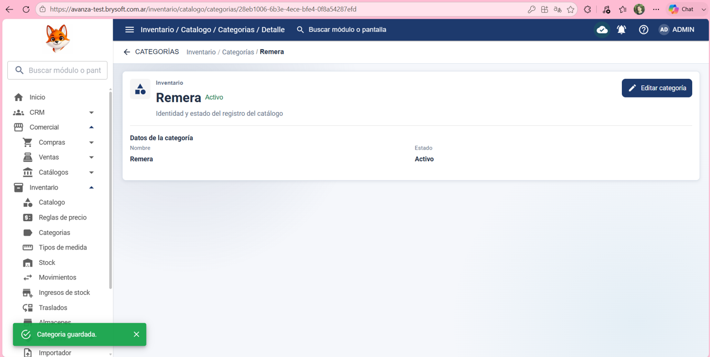
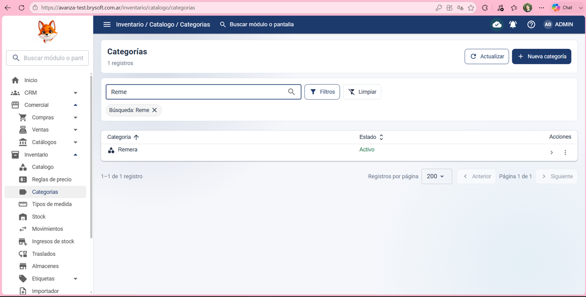

Precondición:
El usuario debe haber iniciado sesión y tener permisos para crear/editar en Inventario > Categorías.

Datos de prueba:
Nombre: Remera

Estado: Activo 

 

Pasos:

1- Hacer clic en: Inventario 

2- Hacer clic en: categoría

3- Hacer clic en: Nueva categoría 

4- Escribir en: Nombre: Remera

5- Poner en: Estado: Activo 

6- Hacer clic en guardar 

Resultado esperado:
Que el sistema cree correctamente una nueva categoría y que lo muestre en la lista de categorías 

Resultado obtenido:
El sistema creó una nueva categoría correctamente y lo mostró en la la lista de categorías 

Estado de la prueba:
✅ PASS

## Evidencia ✅ PASS

### 1. Creación de categoría

### 2. Categoría guardada

### 3. Verificación en la lista

