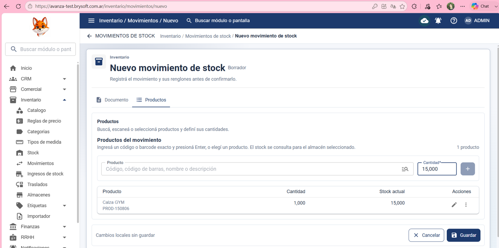

Precondición:
El usuario tiene que iniciar sesión correctamente y tener permiso para ver inventario y agregar un nuevo movimiento de stock 

Datos de prueba:
Almacén: Fabrica 

Tipo: Entrada

Proveedor del ingreso: La Diva Toxica

Referencia: Buena

Observación: Cómodas y buena calidad 

Producto: 6972858362262

Cantidad: 15

Pasos:

1- Hacer clic en Inventario

2- Hacer clic en Movimiento

3- hacer clic en nuevo movimiento

4- Poner en: Almacén: Fabrica 

5- Poner en: Tipo: Entrada

6- Poner en: Proveedor del ingreso: La Diva Toxica

7- El sistema no permite consultar/seleccionar proveedores.

8- Poner en: Referencia: Buena

9- Poner en: Observación: Cómodas y buena calidad 

10- Hacer clic en el tab productos 

11- Poner en: Producto: 6972858362262

12- Poner en: Cantidad: 15

13- Hacer clic en guardar 

Resultado esperado:
Que el sistema permita agregar un nuevo movimiento de stock correctamente y impacte en el producto en la lista de movimiento. 

Resultado obtenido:
El sistema no permite consultar ni seleccionar proveedores. Al ser un campo obligatorio, el movimiento no puede guardarse aunque los demás datos y productos estén completos.

Estado de la prueba:
 ❌ FAIL
## Evidencia

### Evidencia 1

### Evidencia 2

### Evidencia 3

### Evidencia 4

### Evidencia 5

