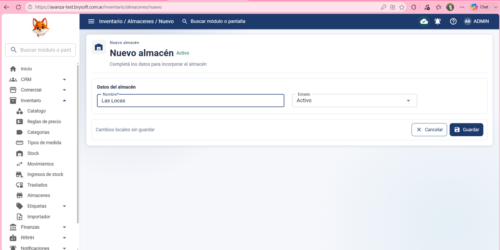
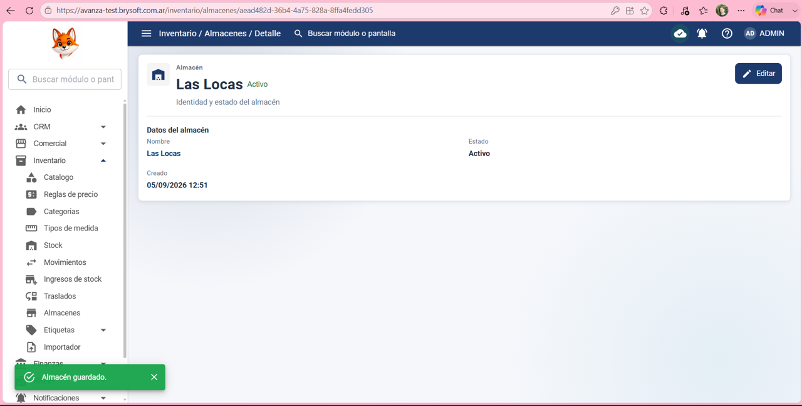
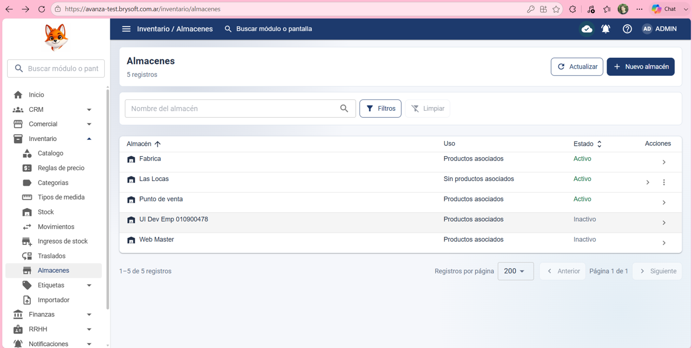

Precondición:
Que el usuario haya iniciado sesión correctamente y tenga los permisos para ver Inventario      > editar y crear almacén.

Datos de prueba:
Nombre: Las Locas

Estado: Activo 

Pasos:

1- Hacer clic en: inventario

2- Hacer clic en: Almacenes 

3- Hacer clic en: Nuevo Almacén 

4- Poner en: Nombre: Las Locas

5- Poner en: Estado: Activo

6- Hacer clic en Guardar 

Resultado esperado:

El sistema debería permitir cargar datos y dar de alta correctamente un almacén nuevo, y permitir ver el almacén en la lista de Almacenes. 

Resultado obtenido:
El sistema permitió dar de alta el almacén correctamente y el almacén creado se muestra en la lista de almacenes 

Estado de la prueba:
✅ PASS

## Evidencia ✅ PASS

### 1. Datos del almacén

### 2. Almacén guardado

### 3. Verificación final

