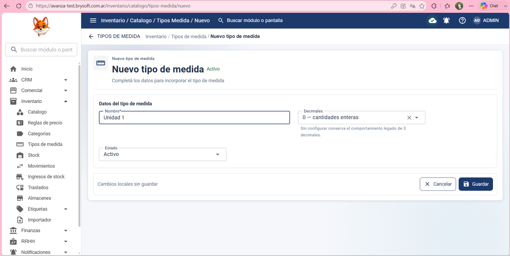
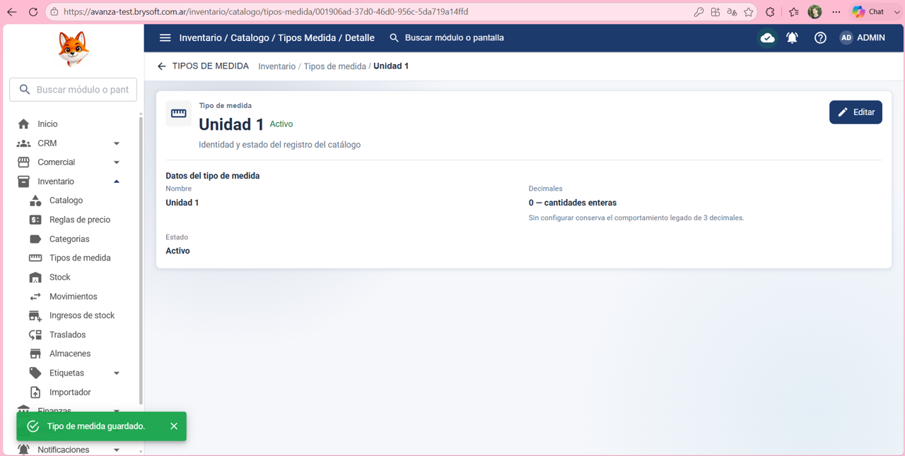
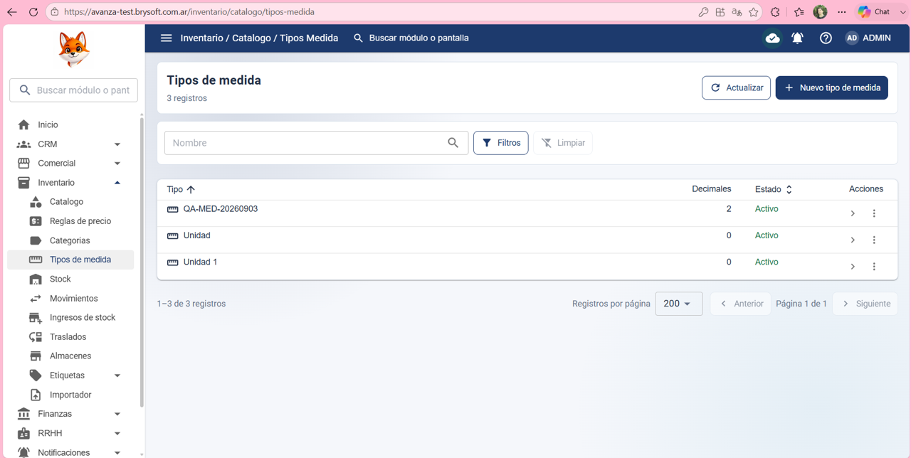

Precondición:
El usuario debe haber iniciado sesión correctamente y tener permiso para ver Inventario y crear/editar Tipos de medidas.

Datos de prueba:
Nombre: Unidad 1 

Decimales: 0 - cantidades enteras

Estado: Activo 

Pasos:

1- Hacer clic en: Inventario

2- Hacer clic en: tipo de medidas

3- Hacer clic en: Nuevo tipo de medida 

4- Poner en: Nombre: Unidad 1 

5- Poner en: Decimales: 0 - cantidades enteras

6- Poner en: Estado: Activo 

7- Hacer clic en: Guardar 

Resultado esperado:
Que el sistema permita crear correctamente un tipo de medida y lo muestre en la lista de Tipos de medidas.

Resultado obtenido:
El sistema permitió crear correctamente un tipo de medida y lo mostro en la lista de Tipos de medidas.

Estado de la prueba:
✅ PASS 

## Evidencia ✅ PASS

### 1. Datos del tipo de medida

### 2. Tipo de medida guardado

### 3. Verificación final

