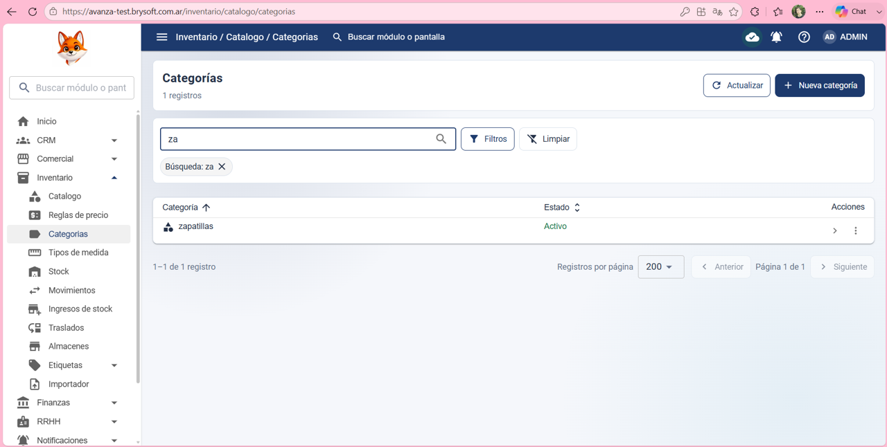
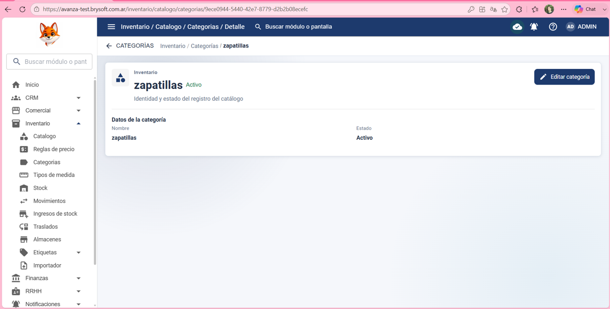
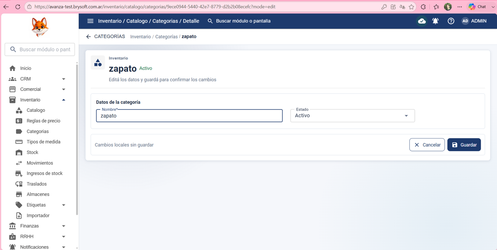
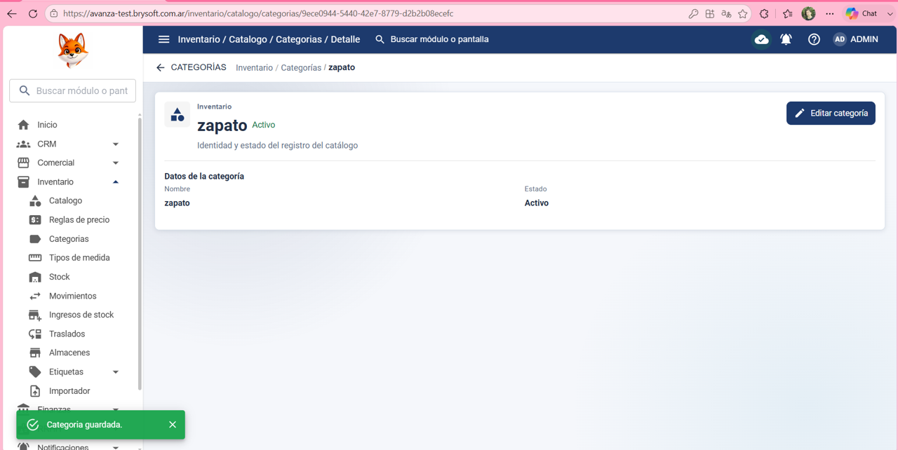

Precondición:
El usuario debe haber iniciado sesión y tener permisos para editar en Inventario > Categorías.

Datos de prueba:

Cambiar en: Nombre: Zapatillas por Zapato

Estado: Activo

Pasos:

1- Hacer clic en Invetario

2- Hacer clic en Categorias

3- Hacer clic en “ > “ de la categoría: Zapatillas 

4- Hacer clic en: Editar Categoría

5- Cambiar el nombre de: Zapatillas por: Zapato

6- Hacer clic en guardar  

Resultado esperado:

Que el sistema permita editar y cambiar el nombre de la categoría: Zapatillas por: Zapato

Resultado obtenido:

El sistema permitió poder editar la categoría Zapatillas y cambiar de nombre por: Zapato  

Estado de la prueba:
✅ PASS

## Evidencia ✅ PASS

### 1. Categoría original

### 2. Edición de la categoría

### 3. Categoría modificada

### 4. Verificación final

