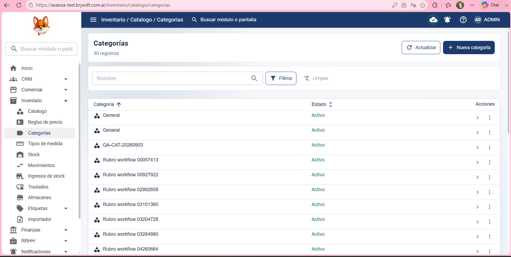
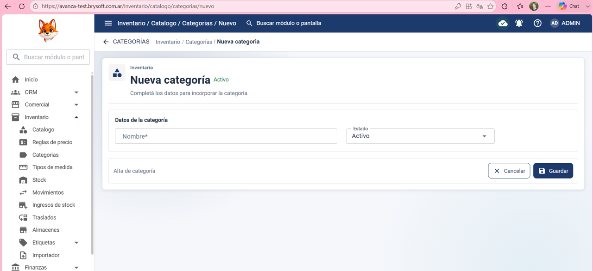
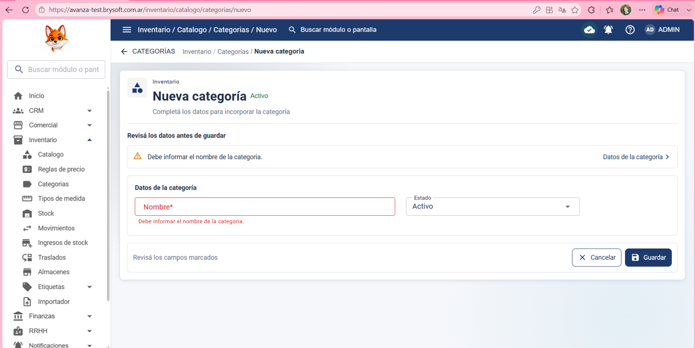

Precondición:
El usuario inició sesión y tiene permisos para crear categorías.

Datos de prueba:

Nombre: vacío

Estado: Activo

Pasos:

Ir a Inventario > Categorías.

Hacer clic en Nueva categoría.

Dejar el campo Nombre vacío.

Seleccionar estado Activo.

Hacer clic en Guardar.

Resultado esperado:
El sistema no debe permitir guardar la categoría y debe informar que el campo Nombre es obligatorio.

Resultado obtenido:

El sistema no permitió guardar la categoría y informa que el campo Nombre es obligatorio.

Estado: ✅ PASS

## Evidencia

### Evidencia 1

### Evidencia 2

### Evidencia 3

