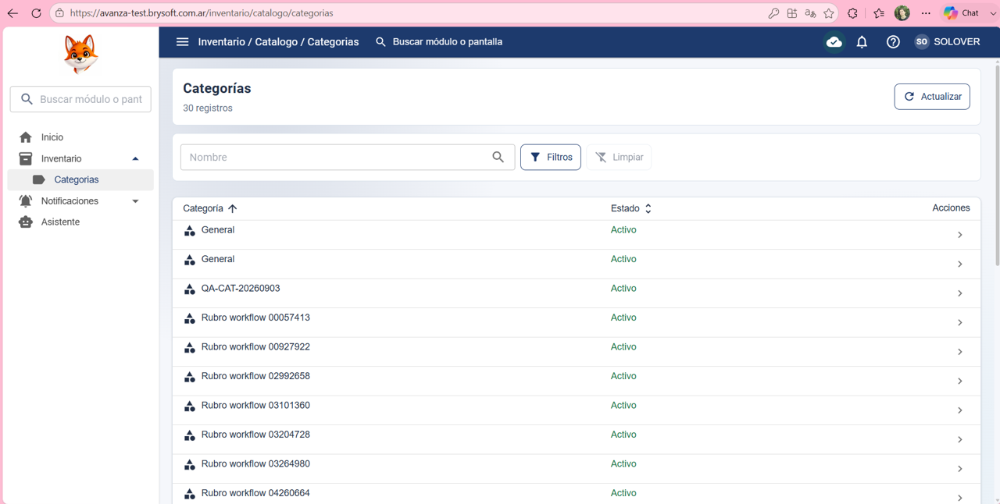
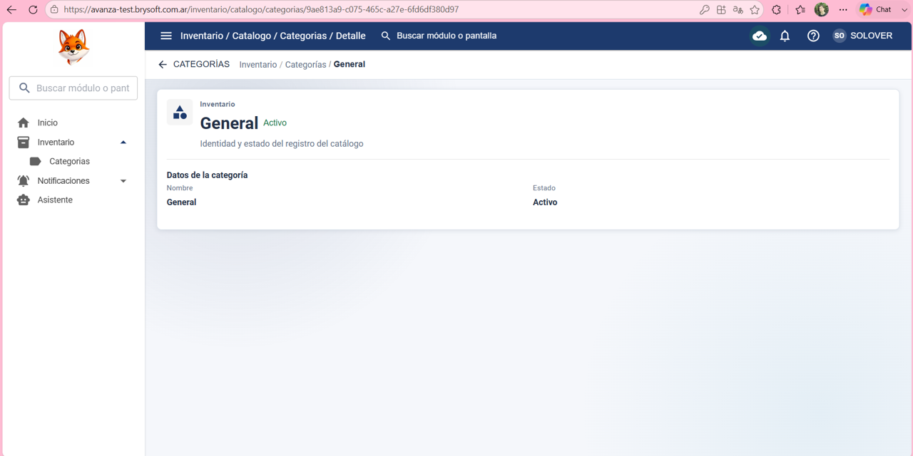

Precondición:
Existe un usuario SOLOVER con permiso Ver en Inventario > Categorías, pero sin permisos de Editar ni Eliminar.

Datos de prueba:
Usuario: SOLOVER
Permisos: VER

Pasos:

Iniciar sesión con el usuario de SOLOVER

Ir a Inventario > Categorías.

Verificar que pueda visualizar la lista de categorías.

Abrir una categoría existente.

Verificar que no pueda editarla.

Verificar que no pueda crear una nueva categoría.

Verificar que no pueda eliminar una categoría.

Resultado esperado:
El usuario puede consultar las categorías, pero no puede crear, editar ni eliminar registros.

Resultado obtenido:

El usuario puede consultar las categorías, pero no puede crear, editar ni eliminar registros.

Estado: ✅ PASS 

## Evidencia

### 1. Vista de categorías en modo solo lectura

### 2. Validación de acceso sin permisos de edición

